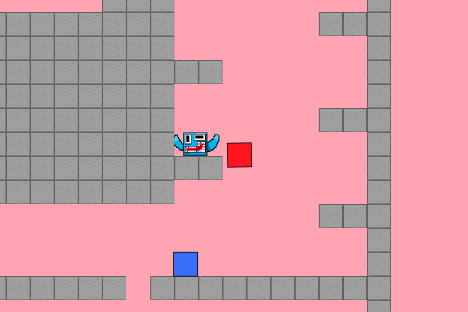
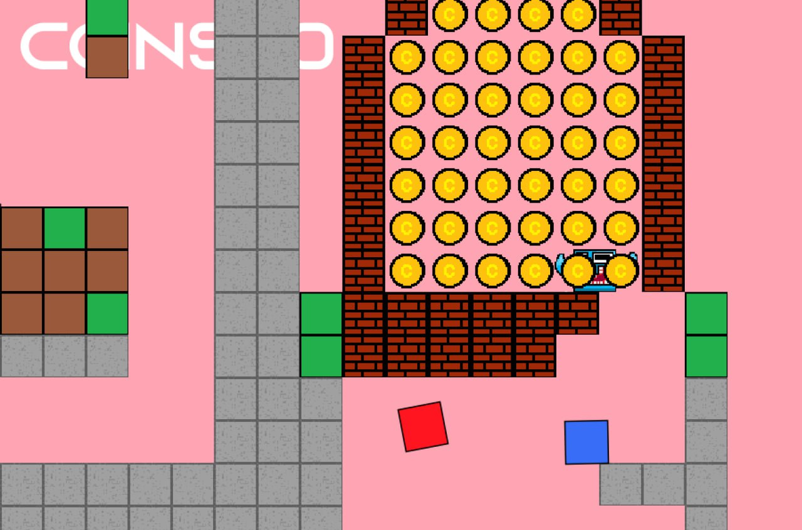
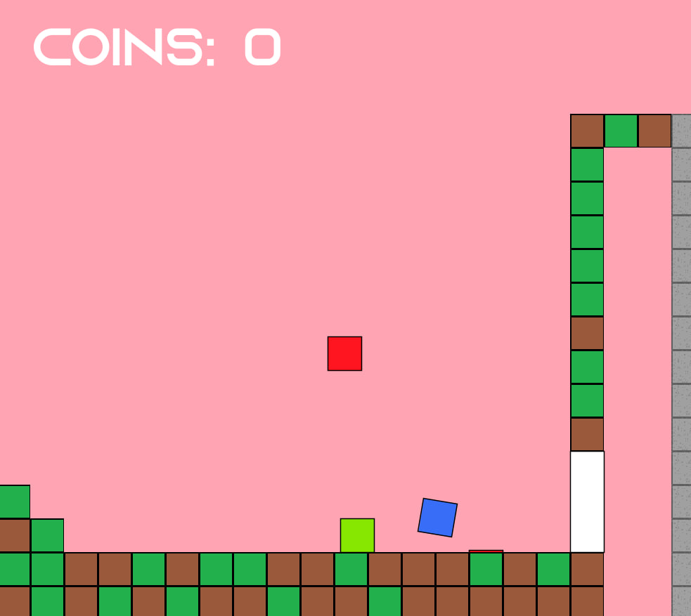
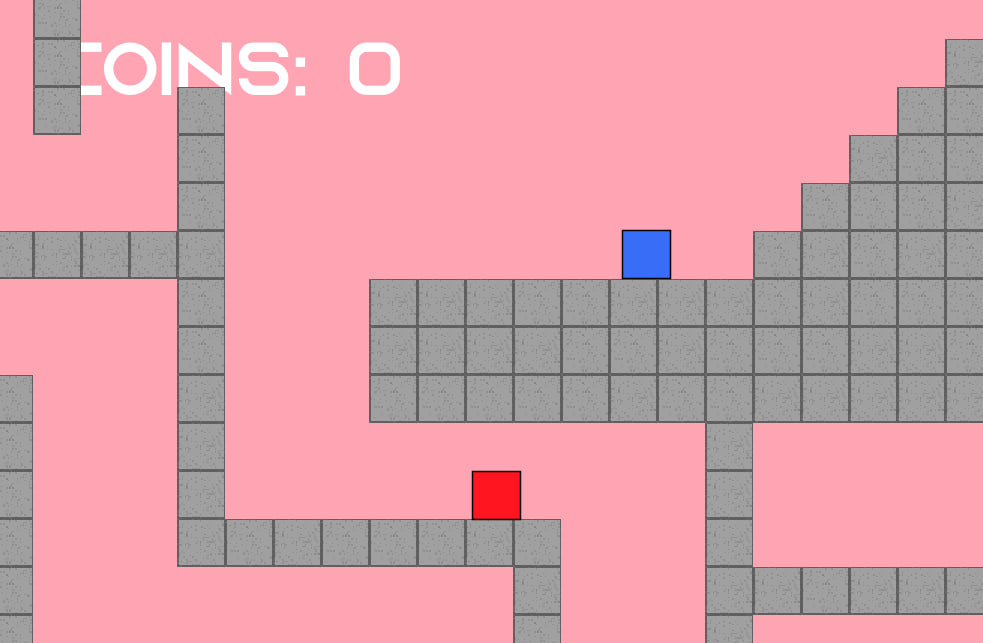

# Puzhius Platformer
Puzhius Platformer is a open-source pixel game with multiplayer created by Puzhius.
## How to install
- To install this, go to [Releases](https://github.com/artemius466/PuzhiusPlatformer/releases) 
- Download latest version
- Unzip this file
- Start the file named "PuzhiusPlatformer.exe"

## Tiled support
Puzhius platformer is also supports [tiled](https://www.mapeditor.org/) maps.

To create them, you need to download [tiled package](https://github.com/artemius466/PuzhiusPlatformer/releases/tag/Other).

## Uploading levels
You may upload levels to [Puzhius Levels telegram bot](https://t.me/PuzhiusLevelsBot).

## Screenshots

## Authors

- [@artemius466](https://github.com/artemius466)
- [@SashaAntipov](https://github.com/SaAn2012)

